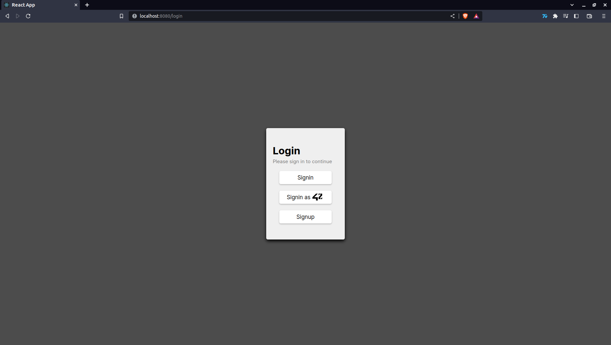
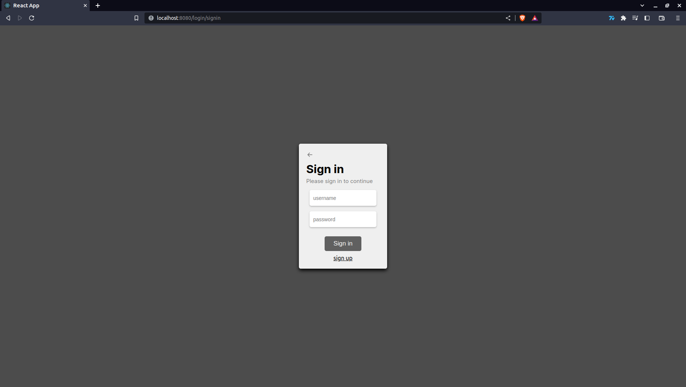
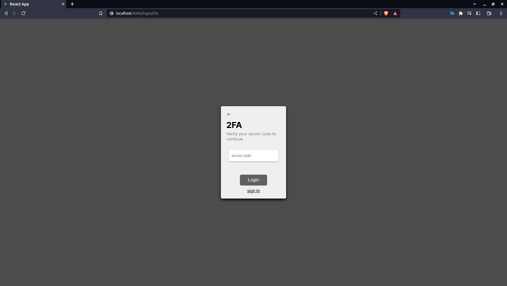
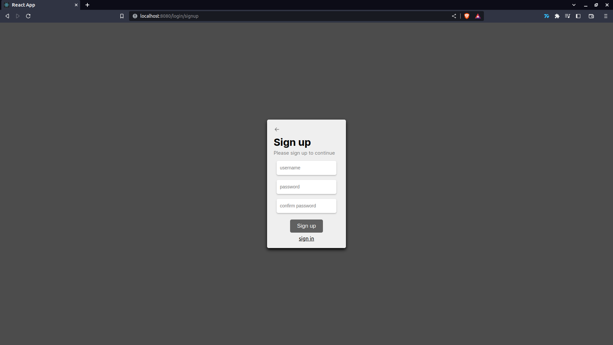
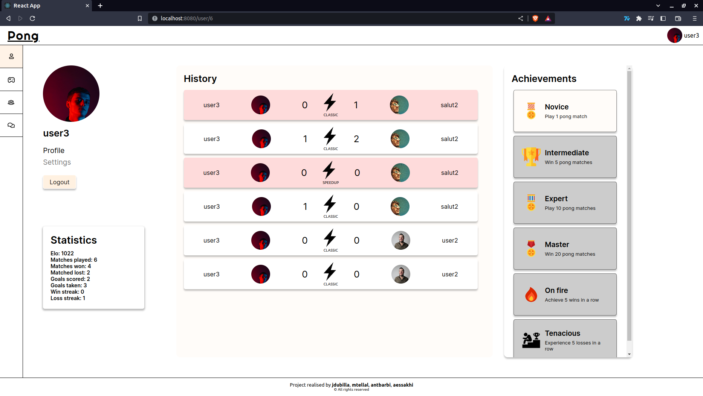
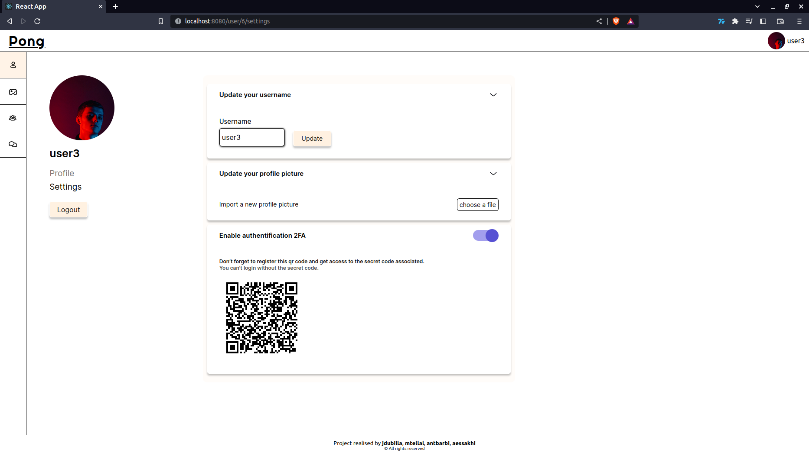
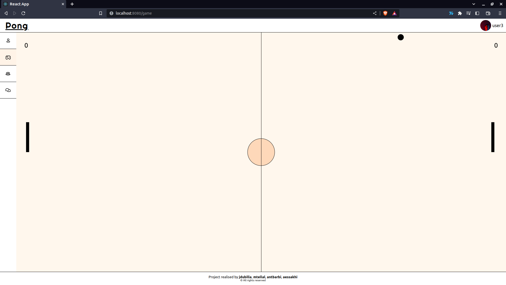
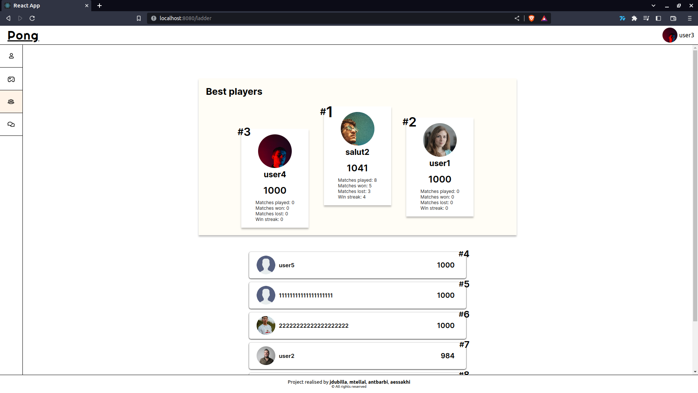
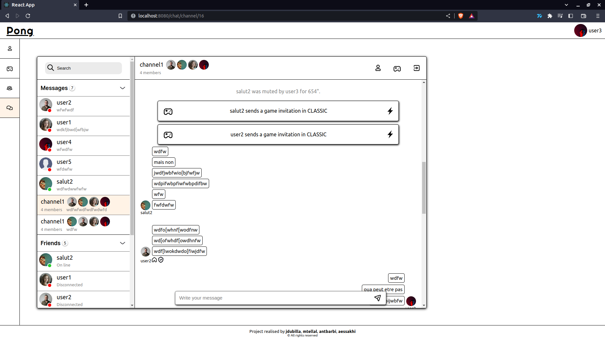
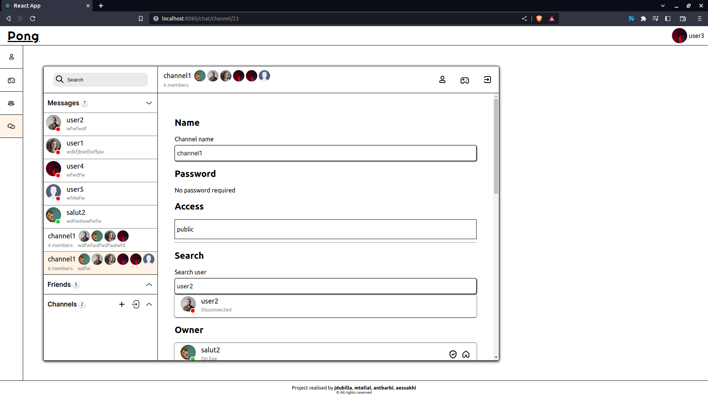

# ft_transcendence

## FRONTEND 
`http://localhost:8080`

## Docs:

### REACT
- https://react.dev/ - React official doc 
- https://stackoverflow.com/questions/54576865/when-to-use-native-react-usereducer-hook-and-how-it-differentiate-from-redux - When to use `useReducer` or `Redux`

### CSS 
- https://github.com/suitcss/suit - suitCSS - naming convention used by twitter 
  ##### BEM
  - https://yandex.com/dev/bem/ - BEM naming convention 
  - https://webuild.envato.com/blog/how-to-scale-and-maintain-legacy-css-with-sass-and-smacss/ 
  - https://www.york.ac.uk/pattern-library/about/css.html 

#### AJAX / HTTP POLLING
- https://advancedweb.hu/how-to-use-async-functions-with-array-map-in-javascript/ - Async map array of promises + explications async/sync processes
- https://stackoverflow.com/questions/12555043/my-understanding-of-http-polling-long-polling-http-streaming-and-websockets

#### Typescript 
- https://mattbatman.com/typescript-and-webpack-and-images - import resolve tsc and webpack

#### Web sockets
- https://javascript.info/websocket -Websocket API

#### Session / Local / Cookies
- https://blog.logrocket.com/storing-retrieving-javascript-objects-localstorage/ - Local Storage / Sessions Storage / Cookies
- https://stackoverflow.com/questions/19183180/how-to-save-an-image-to-localstorage-and-display-it-on-the-next-page - Serialize an image (in canvas) into Local Storage
- https://dev.to/rdegges/please-stop-using-local-storage-1i04 - Bad use cases of Local Storage 
  ##### More docs (security / XSS / local storage / session / cookies)
  - https://cheatsheetseries.owasp.org/cheatsheets/HTML5_Security_Cheat_Sheet.html#Local_Storage
  - https://jwt.io/ - javascript web token (encode data structure into a jwt)
  - https://blog.codinghorror.com/protecting-your-cookies-httponly/ - cookies and xss attack
  - https://michalzalecki.com/why-using-localStorage-directly-is-a-bad-idea/ - local storage errors safari / chrome and others ...

## BACKEND 
`http://localhost:3000`

## Docs:

#### General NestJS documentation
- [Nestjs Docs](https://docs.nestjs.com/)

#### Building a REST API
- [Build a REST API with NestJS and Prisma](https://www.youtube.com/watch?v=LMjj1_EK4y8) - Used to create a basic User module with CRUD endpoints

#### Uploading
- [Blog Project - NestJS](https://www.youtube.com/playlist?list=PLVfq1luIZbSnytbsm2i8Ocf_hyUHTsqbZ) - Great playlist about creating a blog using NestJS. Very useful infos about image uploading, using AuthGuard to protect endpoints

#### Authentification
- [Authentification using Prisma and NestJS](https://www.prisma.io/blog/nestjs-prisma-authentication-7D056s1s0k3l) - Implementing authentification in a REST API

#### Realtime Chat with Websockets
- [Realtime Chat App](https://www.youtube.com/playlist?list=PLVfq1luIZbSkICzoA8EuvTskPEROS68i9) - Playlist about creating a realtime chat app using NestJS.
- [Real-time chat with WebSockets](https://wanago.io/2021/01/25/api-nestjs-chat-websockets/)
- [Socket.io JWT](https://www.npmjs.com/package/socketio-jwt)

## Sockets:

### Events

#### Users Gateway

The Users Gateway doesn't listen to any events, however it emits:
- updatedFriend: will send an updated User object to every user of a friendlist in case of update (profile picture, name...)

- updatedMember: will send an updated User object to every user of every channel joined by the user

- receivedRequest: will be sent to the recipient of a friend request once it is posted

- addedFriend: will be sent to the user who sent the friend request only if it is accepted

- removedFriend: will be sent to the user if he has been removed from a friend list

- blockedUser: will be sent to the user who blocked someone with the blocked object

- unblockedUser: will be sent to the user who unblocked someone with the userId of the unblocked user

- acceptedInvite: will be sent to both users once a game invite has been accepted with the corresponding Game object

#### Chat Gateway

Channel creation is done through a request, once a channel is created, a 'newChannel' event is emitted to every member of the newly created Channel

The backend listens to these events: 
- 'message': Takes the channelId and the content of the message in the dto. Message will be emited only to the users of that room through a 'message' event

- 'joinChannel': Takes a channelId and a password (optional). Join the given channel. Will emit 'joinedChannel' to the room when the User is added to the Channel in the db

- 'addtoChannel': Takes a channelId and a userId. Only administrators can add someone to a channel. Will emit 'addedtoChannel' to the room and to the newly added User

- 'leaveChannel': Takes a channelId. Will emit 'leftChannel' to the room and 'ownerChanged' if the user who left was the owner of the Channel

- 'kickUser', 'banUser': Takes a channelId, userId and a reason (optional). Administrators can use admin actions on members and owner can use admin action on anyone. Emits a 'kickedUser' event

- 'muteUser': Takes a channelId, userId, a duration and a reason (optional). A muted user can't send messages to the given channel. Emits a 'mutedUser' event to the room

- 'unmuteUser': Takes a channelId and a userId. Only an admin can unmute a User and only an owner can unmute an admin. Emits a 'unmutedUser' to the room

- 'banUser': Takes a channelId, userId and a reason (optional). Emits 'bannedUser' to the room and forcibly removed the User from the channel via socket.leave(...)

- 'unbanUser': Takes a channelId and a userId. Emits 'unbannedUser' to the room.

- 'makeAdmin': Takes a channelId and a userId. Only the owner can make someone else admin. Emits 'madeAdmin' to the room

- 'removeAdmin': Takes a channelId and a userId. Emits 'removedAdmin' to the room

- 'updateChannel': Takes a channedId and a name (optional) or a type (optional) or a password (optional). Emits 'updatedChannel' to the room with the updatedChannel object

- 'sendInvite': Takes a channelId and a gametype in the dto. Can't send an invite if muted. Emits the invite as a message with the type INVITE and the gameId of the newly created game room as content

- 'acceptInvite': Takes a message id as a parameter. If it's a valid invite, will emit 'acceptedInvite' to both players with the game room object containing relevant info

- 'updatedInvite': Will send the updated invite after it has been accepted to the Channel OR when it has been made invalid.
For instance, if a user sends 20 invites in a Channel and one is accepted, the Channel will receive 19 updatedInvite with the invalid invite (acceptedBy set to -1) and the accepted invite (acceptedBy set to the correct userId)

#### Games Gateway

The Games gateway listens to those events:

- 'join': Takes a dto corresponding to the gametype (CLASSIC, SPEEDUP, HARDMODE). Will join a pending game with that gametype if found. Else will create a game and wait for another player. It will emit: 
  - In both cases: 'joinedGame' with the game room
  - 'waitingforP2' if a game is created and we're waiting for another player
  - 'foundGame': if a pending game is found
  - 'GameStart': When the game is ready (two players joined)
  

- 'joinInvite': Takes a gameId as parameter. Uses the same events as 'join'. However, the match will only start if both users are connected to the game socket and joined the room.

- 'cancel': Deletes a matchmaking game

- 'moveUp': takes a roomId (number) as parameter

- 'moveDown': same as above

The Games gateway emits those events:

- 'updatedState': sends a GameState object to the room every 17ms

- 'finishedGame': sends the updated Game object to the room when it's over (P1Wins or P2Wins)

## PRESENTATION
### LOGIN

### SIGNIN

### 2FA

### SIGNUP

### PROFILE

### PROFILE SETTINGS

### GAME

### LADDER

### CHAT

### CHAT CHANNEL

### CHAT CHANNEL PROFILE

